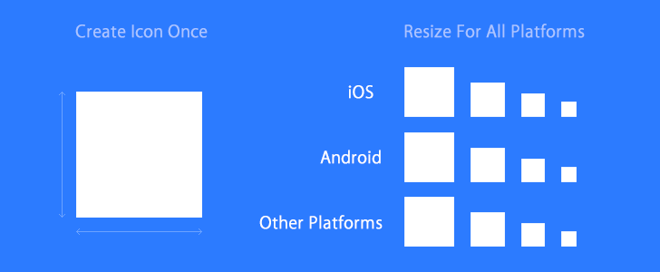

# cordova-icon2



Automatic icon resizing for Cordova. Create an icon in the root folder of your Cordova project and use cordova-icon2 to automatically resize and copy it for all the platforms your project supports (currenty works with iOS, Android, Windows 10 and OSX).

forked from cordova-icon(https://github.com/AlexDisler/cordova-icon).

### Installation

```bash
$ sudo apt-get install imagemagick
$ # on Mac: brew install imagemagick
$ # on Windows: http://www.imagemagick.org/script/binary-releases.php#windows (check "Legacy tools")

$ sudo npm install https://github.com/ichihara-yamato/cordova-icon2 -g
```
If you are using an older version of cordova (before 10.x):

```bash
$ sudo npm install https://github.com/ichihara-yamato/cordova-icon2 -g
```

### Requirements

- **ImageMagick installed**
- At least one platform was added to your project ([cordova platforms docs](http://cordova.apache.org/docs/en/edge/guide_platforms_index.md.html#Platform%20Guides))
- Cordova's config.xml file must exist in the root folder ([cordova config.xml docs](http://cordova.apache.org/docs/en/edge/config_ref_index.md.html#The%20config.xml%20File))

### Usage

Create an `icon.png` file in the root folder of your cordova project.
You can provide a platform-specific icon by naming it `icon-[platform].png`
(e.g `icon-android.png`, `icon-ios.png`).
Then run:

     $ cordova-icon2

You also can specify manually a location for your `config.xml` or `icon.png`:

     $ cordova-icon2 --config=config.xml --icon=icon.png

If you run a old version of Cordova for iOS / Mac and you need your files in `/Resources/icons/`, use this option:

     $ cordova-icon2 --xcode-old

For good results, your file should be:

- square
- for Android and iOS, at least 1024\*1024px
- for Windows, at least 1240\*1240px

#### Notes:

- Your `config.ml` file will not be updated by the tool (because images are automatically created in the good folders)
- Therefore, in your `config.xml`, be sure to remove all lines looking like `<icon src="res/android/ldpi.png" density="ldpi" />`

### Creating a cordova-cli hook

Since the execution of cordova-icon2 is pretty fast, you can add it as a cordova-cli hook to execute before every build.
To create a new hook, go to your cordova project and run:

    $ mkdir hooks/after_prepare
    $ vi hooks/after_prepare/cordova-icon2.sh

Paste the following into the hook script:

    #!/bin/bash
    cordova-icon2

Then give the script +x permission:

    $ chmod +x hooks/after_prepare/cordova-icon2.sh

That's it. Now every time you `cordova build`, the icons will be auto generated.

### License

MIT
